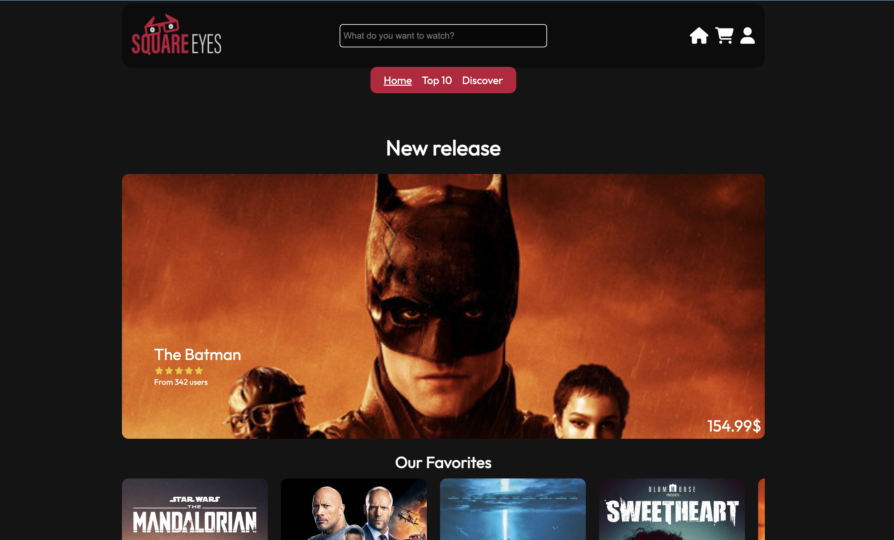

## Square Eyes

## cross-course assignment



[See live site](https://cross-course-project-veskje.netlify.app/)

## Description

School assignment were I am learning to create a website from Design1-course with HTML, CSS & JS.

## Assignment Brief

For this course assignment, we were tasked with creating SquareEyes, our personalized prototype based on the previous course assignment. The objective was to develop a fully functional and visually appealing website using HTML, CSS, and JS. To meet the requirements, we had to ensure the code followed neat semantic practices, demonstrate responsiveness, and adhere to the CSS principles of DRY (Don't Repeat Yourself). When appropriate, we could incorporate Flexbox and Grid. Additionally, the website needed to be WCAG compliant, prioritizing accessibility. It's important to note that the use of frameworks was not permitted for this assignment.

## Built With

- HTML
- CSS
- JavaScript

## Getting Started

### Installing

1. Clone the repo:

```bash
git clone https://github.com/Noroff-FEU-Assignments/cross-course-project-EVeskje.git
```

## Contributing

If you have any feedback or suggestions to make the project better, please fork the repo and create a pull request!

## Contact

Reach me at [linkedIn](https://www.linkedin.com/in/env-link/) or send an email to eirik.nv@hotmail.com
